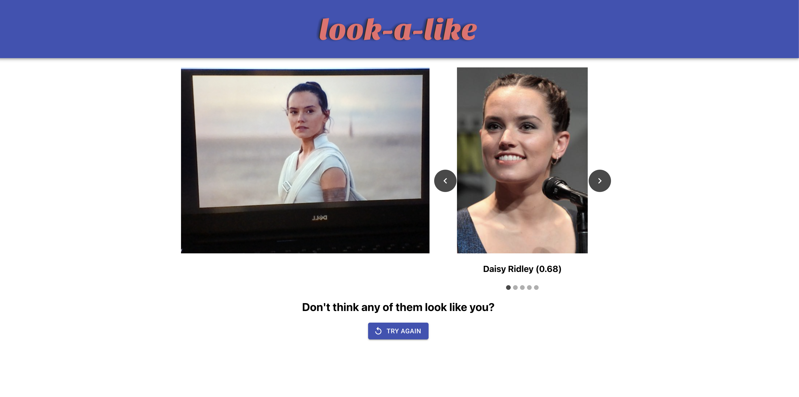
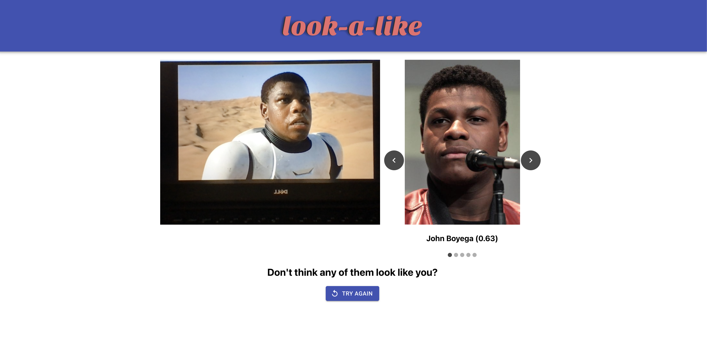

# Lookalike

Lookalike combines machine learning and an efficient vector similarity search to help you to find your celebrity lookalike!

## Examples

Below is the lookalike UI, showcasing the webcam capture and viewing of the results. The results I get a somewhat unflattering, so I've used the closest printed face I could find.


To prove that the lookup is actually doing something beyond a random guess, see the below images, where if an unseen image of a famous person's face is given as input (via a highly advanced image transfer technique), lookalike correctly returns themselves as their celebrity lookalike. Neat!

Ryan Reynolds returns Ryan Reynolds:


Rey from Star Wars returns Daisy Ridley:


Finn from Star Wars returns John Boyega:


## Demo

Lookalike is a bit expensive for me to host over the internet, so the best way to try it out yourself is using my demo image. All you need is [Docker](https://www.docker.com/products/docker-desktop), and an x86-64 (i.e. not M1 Mac) machine. With those prerequisites, simply run:

```bash
docker run -p 8080:8080 -p 8081:8081 -p 5000:5000 ghcr.io/haydenjeune/lookalike-demo:latest
```

When the container has started, open http://localhost:8080 in your web browser.

(Apologies about the ~1GB+ container image, it's a whole Python interpreter + PyTorch + all of the celebrity images)

## How it works

### Overview

Lookalike uses a [pretrained facial recognition model](https://github.com/timesler/facenet-pytorch) to generate a vector that encodes what your face "looks like", given an image of your face. This vector is then compared to a bank of over 40,000 celebrity faces, and a selection of the closest matches are returned for you to see. All this happens in under 200ms on my machine.

### Components

Lookalike consists of several different components, all of which are hosted inside this monorepo. Everything is written in Python and built with [Pants](https://github.com/pantsbuild/pants), except for the UI. I've logically divided the components into jobs and services. Jobs are run as a one off to fetch and process the bank of celebrity names, images, and vectors. Services are the processes which interact with users in real time, and require the bank of celebrity data to provide a result.

#### Scraper Job

The purpose of the Scraper Job is to retrieve a list of celebrity names, and push them to a queue. The best place that I could find to programatically extract names, while still respecting any Robots.txt for the domain was the [IMDB StarMeter page](https://www.imdb.com/search/name/?match_all=true). This page provides 50 names at a time, which the scraper job extracts and pushes to a SNS queue in batches.

#### Worker Job

The purpose of the Worker Job is to fetch an images of a celebrity, generate a vector representation of their face, then save both the image and the generated vector to a filesystem. The Worker reads celebrity names from the output SNS queue of the scraper job, allowing them to be run in parallel. Google Images would be by far the best way to find an image from a persons name, however this is not allowed by their Robots.txt. In lieu of a real search, the worker job tries to manually construct the URL of that persons Wikipedia page, then selects the first image that has a face in it. Any error in this process will result in that name being ignored.

#### Indexer Job

The purpose of the Indexer Job is to take all of the celebrity face vectors, and build an index to use for an efficient vector similarity search. It does this by scanning the filesystem that the Worker has written the face vectors to, and combining them into a single index for use with the [FAISS](https://github.com/facebookresearch/faiss) library, which gives us the ability to search a large set of vectors in a time period that increases more slowly than the size of the set of vectors. This allows us to use a large number of celebrities, and still find a match in real time. The size of the database is currently 40,000 faces/vectors, however my testing suggests that it would be able to scale up to around 1m and still return a response in about 500ms. If only I could find a database with that many faces.

#### Api Service

The API Service is a simple Flask API that takes a base64 encoded image, and returns a list of the closest celebrity matches. It is designed to be called by the UI. The API service decodes the image, detects the face in the image, and runs the facial recognition model to obtain a vector of the users face. It then queries the Index Service, which will return a small number of close matches to that vector, which are returned to the UI.

#### Index Service

The Index Service is a gRPC service which provides an interface to query a FAISS index. The main reason that the FAISS lookup was not hosted in the API process was that PyTorch and FAISS both rely on OpenMP, and make some relatively incompatible assumptions about which variety of OpenMP libraries must be used, and where they are. The end result is that is was much easier to split the PyTorch and FAISS bit out into separate processes and communicate over gRPC.

#### UI

The UI is a React Application that is bundled into a set of static files. It uses the webcam to take a picture, sends that picture to the API service, and displays the list of celebrity names that it receives.
